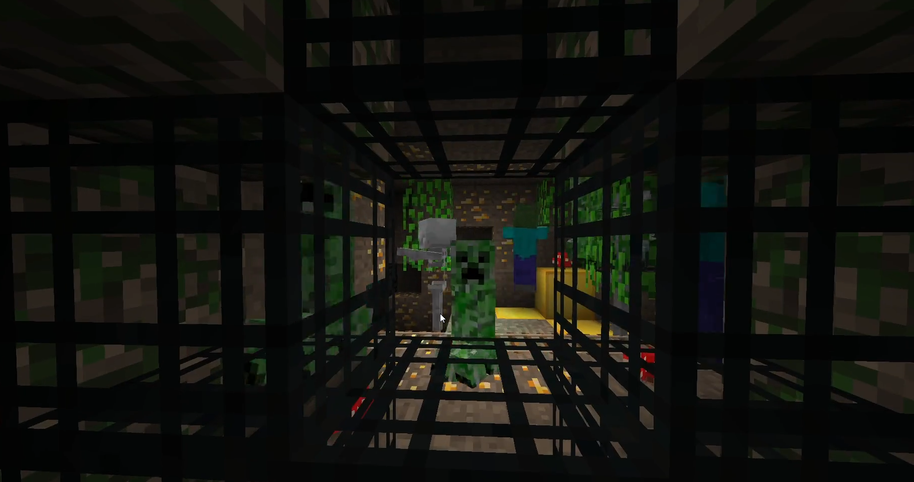

<!-- markdownlint-disable MD033 -->
# MCPY

Source code for each episode of my Minecraft clone in Python YouTube tutorial series.



## Introduction

Click on the thumbnail below to watch the introduction video:

[](https://youtu.be/YgvNuY8Iq6Q?list=PL6_bLxRDFzoKjaa3qCGkwR5L_ouSreaVP)

## Prerequisites

Here is the setup video for Windows 10:

[](https://youtu.be/lrAIYPlvMZw?list=PL6_bLxRDFzoKjaa3qCGkwR5L_ouSreaVP)

And for Debian-based Linux distros:

[](https://youtu.be/TtkTkfwwefA?list=PL6_bLxRDFzoKjaa3qCGkwR5L_ouSreaVP)

The `pyglet` module is a necessary dependency for all episodes, the `nbtlib` & `base36` modules are necessary dependencies for all episodes starting with 11.

The `pyglm` and PyImGUI modules are necessary for the `community` directory. You can install them with PIP by issuing:

- Without community additions:

```console
pip install --user pyglet nbtlib base36 pyglm
```

- With community additions:

```console
pip install --user -r community/requirements.txt`.
```

## Running

Run the following command in the directory of any episode to run the result from that episode:

```console
python3 main.py
```

This tutorial requires Python version 3.8 minimum (#56, with only a few changes though, it can run on versions much lower).

## Community

The `community` directory is for experiments & contributions made by other people on the latest tutorial's code (see PR [#29](https://github.com/obiwac/python-minecraft-clone/pull/29)).
It more generally extends the project with functionality I've yet to cover in a tutorial or that I don't intend on covering at all.
Characteristic contributions are contributions which *add* something to the code.
Contributions which *fix* something are still merged on the source of all episodes.

The community has several features and options that can be toggled in `options.py`:

- Render Distance: At what distance (in chunks) should chunks stop being rendered
- FOV: Camera field of view

- Indirect Rendering: Alternative way of rendering that has less overhead but is only supported on devices supporting OpenGL 4.2
- Advanced OpenGL: Rudimentary occlusion culling using hardware occlusion queries, however it is not performant and will cause pipeline stalls and decrease performance on most hardware - mostly for testing if it improves framerate
- Chunk Updates: Chunk updates per chunk every tick - 1 gives the best performance and best framerate, however, as Python is an slow language, 1 may increase chunk building time by an ludicrous amount
- Vsync: Vertical sync, may yield smoother framerate but bigger frame times and input lag
- Max CPU Ahead frames: Number of frames that the CPU can go ahead of a frame before syncing with the GPU by waiting for it to complete the execution of the command buffer, using `glClientWaitSync()`
- Smooth FPS: Legacy CPU/GPU sync by forcing the flushing and completion of command buffer using `glFinish()`, not recommended - similar to setting Max CPU Ahead Frames to 0. Mostly for testing whether it makes any difference with `glClientWaitSync()`

- Smooth lighting: Smoothes the light of each vertex to achieve a linear interpolation of light on each fragment, hence creating a smoother light effect - it also adds ambient occlusion, to simulate light blocked by opaque objects (chunk update/build time will be severely affected by this feature)
- Fancy translucency: Better translucency blending, avoid weird looking artefacts - disable on low-end hardware
- Mipmap (minification filtering): Texture filtering used on higher distances. Default is `GL_NEAREST` (no filtering) (more info in `options.py`)
- Colored lighting: Uses an alternative shader program to achieve a more colored lighting; it aims to look similar to Beta 1.8+ (no performance loss should be incurred)
- Antialiasing: Experimental feature
- A main menu / UI system: Uses PyImGUI to create a menu system which appears when the game loads instead of loading the world straight away.

## List of projects based on this

- **Nim implementation:** <https://github.com/phargobikcin/nim-minecraft-clone>
- **Java implementation:** <https://github.com/StartForKillerMC/JavaMinecraft>
- **C++ implementation:** <https://github.com/Jukitsu/CppMinecraft-clone>
- **Odin implementation:** <https://github.com/anthony-63/lvo>
- **Lua implementation:** <https://github.com/brennop/lunarcraft>
- **Javascript implementation:** <https://github.com/drakeerv/js-minecraft-clone> ([Demo](https://drakeerv.github.io/js-minecraft-clone/))
